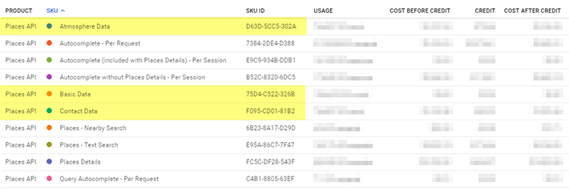

# Understanding Places API Billing

Places API billing on Google Maps Platform is very different from previous licensing models. Each service is billed as its own SKU, with an associated cost per-thousand-requests (CPM). You may also see additional charges depending on what data is returned from the service.

This guide will help you understand each of the SKUs you see on your Maps Platform bill.

## Places SKUs

It's helpful to think of the Places API SKUs in two groups: **services** and **data**.

### Service SKUs

In your billing report, you will see a line item for each Places API service you use, with the total number of requests made in the **Usage** column.

**Autocomplete Per-Session** is unique, there is *no cost for these requests*. However, each Autocomplete session ends with a Place Details request, and *you pay for those Place Details requests* (see below), which will appear as their own SKU on your bill.

> ⚠️ If you are using Autocomplete but have not implemented **session tokens**, your usage will be billed *per-request* (see below). Refer to [Google's documentation](https://developers.google.com/maps/billing/understanding-cost-of-use#about-autocomplete-sessions) to learn about the new session tokens feature and how to implement them in your code. This affects all existing applications not using Google's first-party Autocomplete widgets.

Some other services have a CPM associated with them, but do not result in data SKU charges. You *pay for every request* made to these services, but *no data charges*:
- **Autocomplete Per-Request**
- **Place Photo**

The remaining Places API services all result in data SKU charges. Based on the fields you request, you will see corresponding data SKU usage for each request to these services. You *pay for each request* to these services, *plus the Contact and/or Atmosphere data charges* (if applicable):
- **Find Place**
- **Place Details**
- **Nearby Search**
- **Text Search**

### Data SKUs

For the above services that retrieve place data, you will see the combined data requested from those services listed under three SKUs: 
- **Basic Data**
- **Contact Data**
- **Atmosphere Data**

**Basic** data is free, its cost is included in the CPMs for each Places API service.

**Contact** and **Atmosphere** data have their own CPMs. If you request any fields from either of these categories in a service, you will see usage from those requests under these SKUs along with the associated cost. 

> ⚠️ For backward compatibility, Places API returns **all fields** by default. Use field filtering to reduce your cost.
 📚 To learn more about field filtering, see our guide: [Place Details Field Filtering](place-details-fields)

> ⚠️ **Nearby** and **Text Searches** do not support field filtering, they will always generate Contact and Atmosphere charges.

Data SKU usage is cumulative across all services. Your Basic data volume will match the total requests for *Find Place + Place Details + Nearby Search + Text Search*. Similarly, the Contact and Atmosphere data volumes will be the total requests for those fields across all Places API services.

## Review Your Billing Report

Your billing report in Cloud Console tells you what your current usage looks like. While the API dashboard simply lumps all Places API traffic together, billing reports can break down Places API usage per-SKU.

Go to the [**Billing**](https://console.cloud.google.com/billing/) page of Cloud Console and select **Reports**. 
Then select **Group by: SKU** and **Products: Places API** in the filter panel on the right side of the page. 
You should see a table similar to this at the bottom of the page (data SKUs highlighted in yellow):

## References

[Places API Pay-as-You-Go Pricing](https://developers.google.com/places/web-service/usage-and-billing#new-payg)

[Understanding Maps Platform Billing](https://developers.google.com/maps/billing/understanding-cost-of-use)
